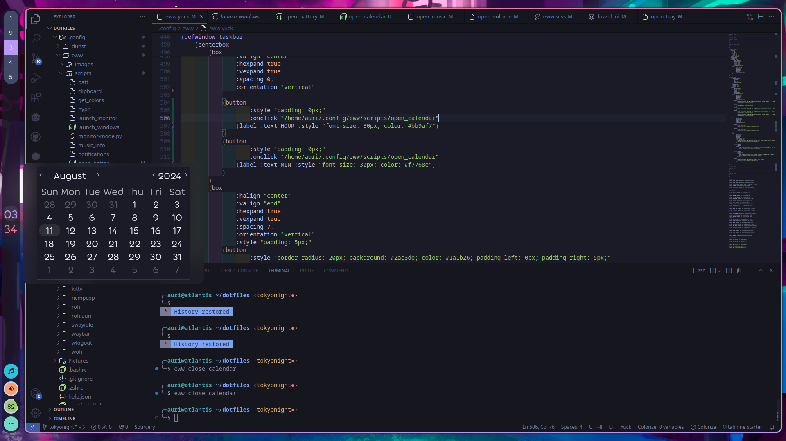

# Dotfiles
Dotfiles for my rices. Each rice has its own branch but only Catppuccin has been tested recently and Dracula and Rosepine are probably broken and lack a lot of stuff.

# Instructions
    git clone https://github.com/auri-the-jelly/dotfiles
Clone the repo and copy files from the repo into the respective folders and change the `.config/eww/scripts/launch_windows` exec to your eww installation. Also install all the dependencies. Very important. Everything with a config folder should be all of them.

Thanks to [adi1090x](https://github.com/adi1090x/widgets) for the music_info script that taught me bash scripting just for this rice.

